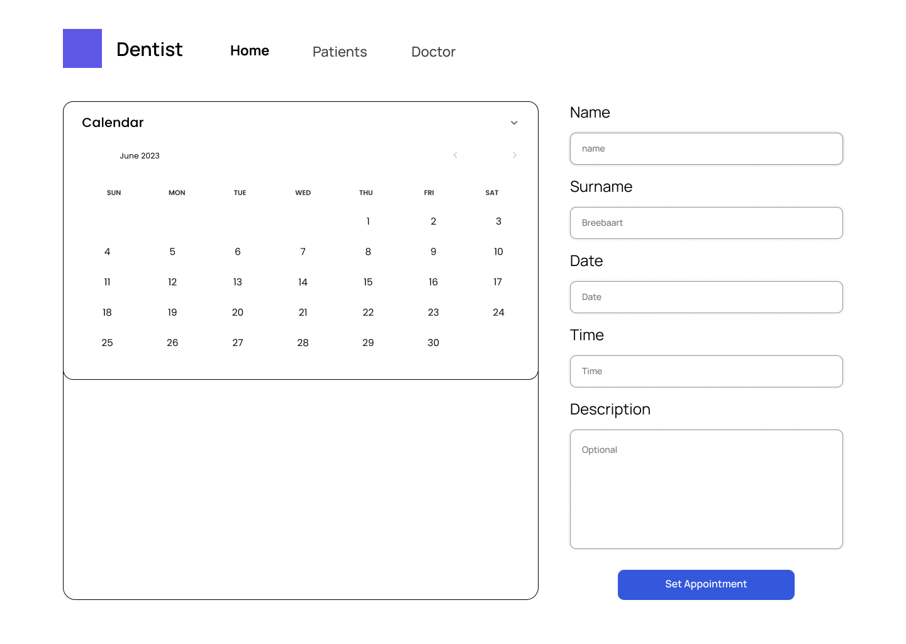
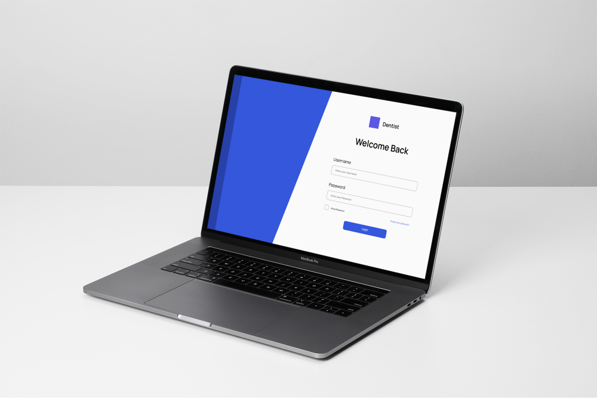

<!-- HEADER SECTION -->
<h5 align="center" style="padding:0;margin:0;">Luca Breebaart</h5>
<h5 align="center" style="padding:0;margin:0;">Student Number 221345</h5>
<h6 align="center">DV200 2023</h6>
</br>
<p align="center">

  <a href="https://github.com/luca-breebaart/Lumina-dentistry">
    
  </a>
  
  <h3 align="center">Lumina Dentistry</h3>

  <p align="center">
A Receptionist Management System for a Dentistry.
    <br>
   <br>
      <a href="https://github.com/luca-breebaart/llumina-dentistry"><strong>Explore the docs »</strong></a>
   <br />
   <br>
   <a href="https://drive.google.com/file/d/1oNTuZ_JMtG6I4u9SSMixXFMrWrnX1Y02/view?usp=sharing">View Demo Video</a>
   <br />

</p>
<!-- TABLE OF CONTENTS -->
<h3>Table of Contents</h3>

* [About the Project](#about-the-project)
  * [Project Description](#project-description)
  * [Built With](#built-with)
* [Getting Started](#getting-started)
  * [Prerequisites](#prerequisites)
  * [How to install](#how-to-install)
* [Features and Functionality](#features-and-functionality)
* [Concept Process](#concept-process)
   * [Wireframes](#wireframes)
* [Development Process](#development-process)
   * [Implementation Process](#implementation-process)
        * [Highlights](#highlights)
        * [Challenges](#challenges)
   * [Future Implementation](#peer-reviews)
* [Final Outcome](#final-outcome)
    * [Mockups](#mockups)
    * [Video Demonstration](#video-demonstration)
* [Conclusion](#conclusion)

<!--PROJECT DESCRIPTION-->
## About the Project
<!-- header image of project -->


### Project Description

Lumina Dentistry is a web application that allows receptionists to manage appointments, doctors, receptionists, and patients in a medical facility. It provides functionalities such as creating appointments, managing doctors and receptionists, and maintaining patient records.

### Built With

* HTML/CSS
* PHP
* MySQL
* XAMMP

## Getting Started

The following instructions will get you a copy of the project up and running on your local machine for development and testing.

### Prerequisites

Before getting started, ensure you have the following software installed:

- [VS Code](https://code.visualstudio.com/)
- [XAMMP](https://www.apachefriends.org/download.html)

### How to install

### Installation
Here are a couple of ways to clone this repo:

1. Software </br>
Create a working folder in which you want this file saved. Then open the folder

`Visual Studio Code` -> `File` -> `Open` -> `Folder Name`</br>

2. Clone Repository </br>
Run the following in the command-line in the terminal to clone the project:
   ```sh
   git clone https://github.com/luca-breebaart/Lumina-dentistry.git
   ```
3. Navigate to the project directory: `cd Lumina`

4. Import the database: Import the provided SQL file `lumina.sql` to your database server.

5. Configure database connection: Update the database credentials in the `db.php` file.

6. Set up the web server: Configure your web server to serve the project directory.

7. Access the application: Open the web browser and enter the URL for the application.

<!-- FEATURES AND FUNCTIONALITY-->

## Features and Functionality

- User Authentication: Login functionality for receptionists to access the system.
- Dashboard: Provides an overview of upcoming appointments and the ability to create new appointments.
- Appointments: Create, view, edit, and delete appointments.
- Doctors: View, add, edit, and delete doctors, including their profile images.
- Receptionists: View, add, edit, and delete receptionists, including their profile images.
- Patients: View, add, edit, and delete patient records.

## Usage

1. Login: On the login page, enter your receptionist name and password to log in to the system.
2. Dashboard: After successful login, you will be redirected to the dashboard. Here, you can view upcoming appointments and create new appointments.
3. Appointments: Navigate to the appointments page to manage appointments. You can create new appointments, view appointment details, edit existing appointments, and delete appointments.
4. Doctors: Go to the doctors page to manage doctors. You can view the list of doctors, add new doctors with their profile images, edit doctor details, and delete doctors.
5. Receptionists: Access the receptionists page to manage receptionists. You can view the list of receptionists, add new receptionists with their profile images, edit receptionist details, and delete receptionists.
6. Patients: Visit the patients page to manage patient records. You can view the list of patients, add new patients, edit patient details, and delete patients.
7. Logout: To log out of the system, click on the "Logout" button.

### Wireframes


<br>

<br>


## Development Process


### Implementation Process

#### Highlights

- Easy-to-Use Design: Made the system easy for everyone to understand, use and follow.
- Many Functions: Created various useful features to help manage appointments, doctors, receptionists, and patient records.

#### Challenges

- Connecting XAMMP: Had difficulties connecting different parts of the system smoothly, especially linking appointments and patient details.
- Debugging: Faced ongoing issues in checking and fixing problems to make the system run smoothly.

### Future Implementation

- Design: Add a calendar on the landing page to manage appointments easier.
- More Functions: Create various useful features to help manage appointments and patient records.
- Security: Ensured that all the information in the system is safe and secure.

<!-- MOCKUPS -->
## Final Outcome

### Mockups


<br>

<br>

<br>

<br>

<!-- VIDEO DEMONSTRATION -->
### Video Demonstration

To see a run-through of the application, click below:

[View Demonstration]([]([https://drive.google.com/file/d/1oNTuZ_JMtG6I4u9SSMixXFMrWrnX1Y02/view?usp=sharing](https://drive.google.com/file/d/1oNTuZ_JMtG6I4u9SSMixXFMrWrnX1Y02/view?usp=sharing)))

<!-- AUTHORS -->
## Authors

* **Luca Breebaart** - [luca-breebaart](https://github.com/luca-breebaart)
